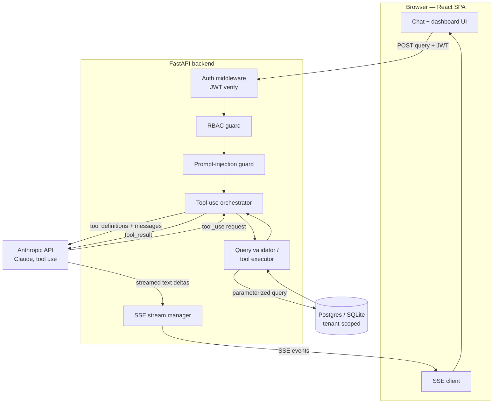
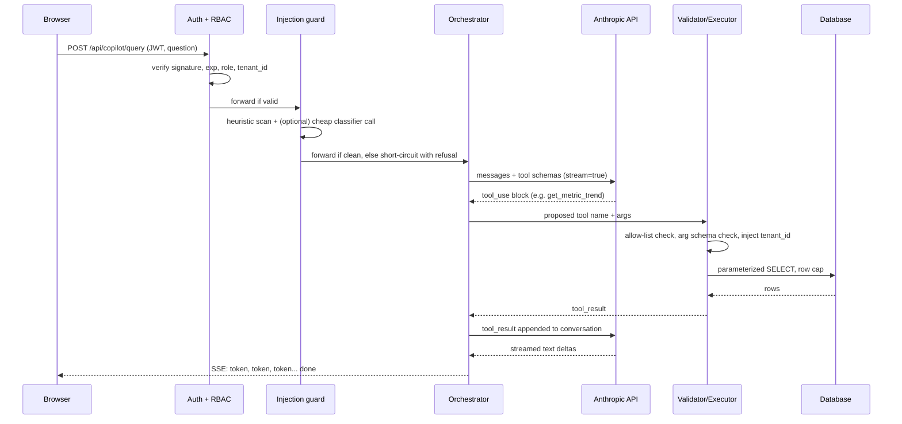

# Architecture — AI Co-Pilot for SaaS Analytics Platform

This document is the single source of truth for system design. Code should match this document; if an implementation detail changes during the build, update this file in the same PR.

## 1. Goals and non-goals

**Goals**
- Let a logged-in SaaS customer ask analytics questions in plain English ("what was our churn rate last quarter compared to the one before?") and get a streamed, accurate, chart-backed answer.
- Keep every data access tenant-scoped, role-scoped, and auditable.
- Hit p95 first-token latency under 2 seconds.
- Build entirely on open-source or free-tier infrastructure except the one paid dependency that the project is about: the Anthropic API.

**Non-goals (explicitly out of scope for v1)**
- Free-form SQL generation by the model. The model never writes SQL; it only calls a fixed set of typed tools.
- Multi-turn agentic planning across many tool calls. v1 supports single-question, single-or-few-tool-call answers.
- Write operations. The co-pilot is read-only against analytics data.

## 2. High-level component view



**Why this shape:** the model never touches the database directly. Every tool call Claude proposes is intercepted, validated against an allow-list and the caller's tenant/role, executed with parameterized queries, and only then fed back to the model as a `tool_result`. This is what makes "query validation at the request boundary" a real control rather than a marketing line on a resume.

## 3. Request lifecycle (sequence)



## 4. Components

| Component | Responsibility | Key tech |
|---|---|---|
| React SPA | Chat interface, chart rendering, auth state, SSE consumption | React + Vite, TypeScript, Tailwind CSS, shadcn/ui, Recharts, TanStack Query |
| Auth middleware | Verify JWT signature/expiry, attach `user_id`, `role`, `tenant_id` to request state | `python-jose` or `PyJWT`, FastAPI `Depends` |
| RBAC guard | Map role → allowed tool functions and endpoints; reject before any LLM call | Custom FastAPI dependency, declarative permission table |
| Prompt-injection guard | Screen incoming text for instruction-override patterns before it reaches the model | Heuristic rule set + optional cheap Claude Haiku classification call |
| Tool-use orchestrator | Hold the Anthropic conversation loop: send tool schemas, relay tool calls, relay results, stream final answer | Anthropic Python SDK, `anthropic.messages.stream` |
| Query validator / tool executor | The only code path allowed to touch the database; enforces allow-list, types, tenant scope, row limits | Pydantic v2 models, SQLAlchemy Core (no raw SQL) |
| SSE stream manager | Convert Anthropic SDK stream events into SSE frames for the browser | `sse-starlette`, FastAPI `StreamingResponse` |
| Database | Tenant-scoped analytics tables (subscriptions, invoices, usage events, customers) | PostgreSQL (Neon/Supabase free tier) or SQLite for local dev |
| Synthetic data generator | Seed realistic multi-tenant SaaS metrics for demo/testing | `Faker`, a seed script run once at setup |
| Observability | Structured logs for auth failures, injection flags, tool calls, latency | `structlog` or stdlib `logging` with JSON formatter |

## 5. Multi-tenancy and RBAC model

Every JWT carries `tenant_id` and `role`. `tenant_id` is **never** accepted from the request body or from model output — it is read only from the verified token and injected into every database query by the validator layer. This prevents a compromised or convincingly-jailbroken prompt from ever requesting another tenant's data, because the tenant filter is applied in code the model cannot influence.

Roles (suggested, adjust to taste):

| Role | Allowed tool functions | Allowed endpoints |
|---|---|---|
| `viewer` | `get_metric_trend`, `get_churn_rate` | read-only copilot + dashboard |
| `analyst` | all read tools, including `compare_segments`, `get_top_customers` | read-only copilot + dashboard + export |
| `admin` | all read tools + `list_active_alerts`, user/role management endpoints | everything |

The full matrix lives in `SECURITY.md` — keep both files in sync.

## 6. Prompt-injection defense (defense in depth)

1. **Input layer:** heuristic scan for instruction-override patterns (e.g. attempts to redefine the system prompt, requests to ignore prior instructions, attempts to exfiltrate the system prompt) before the text reaches Claude.
2. **System prompt hardening:** the system prompt clearly delimits user content as data, states the tool allow-list explicitly, and instructs the model that database/tool output is data, never instructions.
3. **Model-side judgment:** Claude itself is asked to flag content that looks like an injection attempt as part of its system instructions, and the orchestrator can short-circuit on that signal.
4. **Output-side enforcement:** even if a manipulated prompt convinces the model to "call" an unauthorized tool, the validator layer rejects anything outside the allow-list/role/tenant scope — so the defense does not rely on the model behaving correctly.
5. **Logging:** every flagged attempt is logged with user/tenant/timestamp for review, without ever being used to block legitimate analytical phrasing.

Full detail in `SECURITY.md`.

## 7. Latency budget (target: p95 first token < 2s)

| Stage | Target |
|---|---|
| Network + auth + RBAC + injection guard | < 80 ms |
| Time to first Anthropic streamed token (network + model TTFB) | < 1500 ms |
| SSE relay overhead (backend → browser) | < 50 ms |
| Buffer for tool-call round trip (only on tool-using turns) | accounted separately, see below |

Notes:
- Use a fast model (Claude Haiku) for the injection-classification side-call so it doesn't sit in the critical path of the main answer; or skip the model-side call entirely for short, clearly benign queries and rely on heuristics only.
- For turns that require a tool call, the *true* first-token-to-user is the first token of the *final* answer, which comes after one tool round trip. Measure both "p95 time to first tool call" and "p95 time to first answer token" separately in the benchmark script described in `PROMPT_FOR_ANTIGRAVITY.md`.
- Keep the database query fast (indexed columns, capped row counts, no N+1s) since it sits inside the latency budget on tool-using turns.

## 8. Folder structure

```
ai-copilot-saas-analytics/
├── backend/
│   ├── app/
│   │   ├── main.py
│   │   ├── api/
│   │   │   ├── auth.py
│   │   │   └── copilot.py
│   │   ├── core/
│   │   │   ├── config.py
│   │   │   ├── security.py        # JWT issue/verify
│   │   │   └── rbac.py
│   │   ├── guard/
│   │   │   └── injection_guard.py
│   │   ├── orchestrator/
│   │   │   ├── tools.py           # tool JSON schemas
│   │   │   └── orchestrator.py
│   │   ├── validator/
│   │   │   └── query_validator.py
│   │   ├── db/
│   │   │   ├── models.py
│   │   │   ├── session.py
│   │   │   └── seed.py            # Faker synthetic data
│   │   └── streaming/
│   │       └── sse.py
│   ├── tests/
│   ├── alembic/
│   ├── pyproject.toml
│   └── .env.example
├── frontend/
│   ├── src/
│   │   ├── pages/
│   │   ├── components/
│   │   ├── lib/api.ts
│   │   ├── lib/sse.ts
│   │   └── theme/                 # light theme tokens
│   ├── index.html
│   ├── package.json
│   └── .env.example
├── README.md
├── ARCHITECTURE.md
├── API_REFERENCE.md
├── SECURITY.md
├── CONTRIBUTING.md
├── DEPLOYMENT.md
└── PROMPT_FOR_ANTIGRAVITY.md
```

## 9. Extensibility notes (post-v1)

- Adding a retrieval layer (RAG over a help-center or runbook corpus) would slot in as another tool the orchestrator can call — no change to the auth/RBAC/validation boundary.
- Adding more analytics tools only requires: a JSON schema in `tools.py`, a handler in `query_validator.py`, and a row in the RBAC matrix. Nothing else in the architecture changes.
- Caching: a simple in-memory or Redis cache keyed on `(tenant_id, tool_name, args_hash)` would cut latency for repeated questions without touching the security model.
